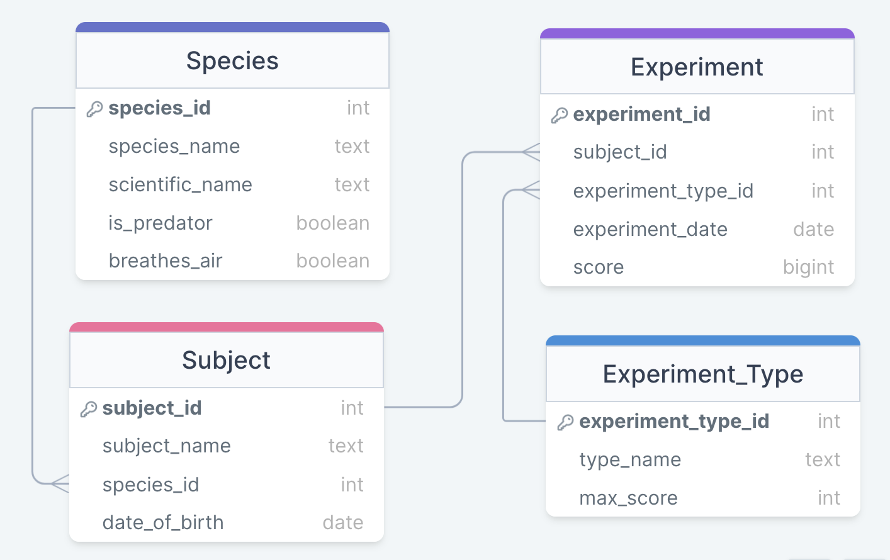

# Marine Experiments API

## Scenario

You've been hired as a contractor by a government agency that must (for security reasons) remain nameless. Their current focus is on training marine animals to complete tasks and (eventually) engage in underwater combat. With sea levels rising all over the world, the battles of the future will be fought beneath the waves.

The agency already has a database to store details of their experiments, but it's currently harder to access than they would like. Ideally, there would be an easy-to-use, consistent API that allowed easy communication with the database. Although there has been some work on the API, it is only **half-finished** (the last developer disappeared mysteriously while on a yachting holiday).

Get set up with the project, and then **work through the tasks** listed below, adding key functionality to the API.

## Setup and installation

1. Navigate to the `marine_experiments` folder
2. Create and activate a new virtual environment
3. Run `pip3 install -r requirements.txt` to install the required libraries
4. Run `psql postgres -c "CREATE DATABASE marine_experiments;"` to create the database.
5. Run `psql marine_experiments -f setup-db.sql` to create and populate the initial database tables

## Development

Run the server with `python3 api.py`; you can access the API on port `8000`.

Reset the database at any time with `psql marine_experiments -f setup-db.sql`.

## Quality assurance

Check the code quality with `pylint *.py`.

Run tests with `pytest -vv`.

## Data model



The `marine_experiments` database has four tables:

- `experiment` for records of individual experiments
- `experiment_type` stores details on the different types of experiment that can be carried out
- `subject` for storing information on individual animals involved in experiments
- `species` which holds details of the different wildlife species involved in the experiments

## WARNING: Do not make another connection

In your `api.py` file you will find this database connection.

> conn = get_db_connection("marine_experiments")

You should **not**

- Make any other connections in your code
- Close that connection

If you do either of these, your tests **will** fail.

## Tasks

The work required of you has been subdivided into a series of tasks. In general, earlier tasks are less complex than later ones. Completing a task should never undo work on earlier tasks.

There is a comprehensive test suite available for all tasks except task 6 (which is an optional extension). Use the test suite to guide your code. You will be assessed on both passing tests and code quality, with passing tests being the most important aspect by far.

The test suite relies on a single global database connection (defined on line 18 of `./marine_experiments/api.py`). **Do not create any new connections in your code; always use the global connection. Do not close the global connection.**

The tasks involve both Python and SQL; as much as possible, **data processing should be completed using SQL**.

### Task 1

A `GET` request to the `/subject` end point should return a list of objects (see example below). Each object should have the following information only:

- Subject ID
- Subject Name
- Species Name
- Date of Birth

Dates should be expressed as strings in the `YYYY-MM-DD` format.

Objects should be ordered by date of birth in descending order.

#### Example response

```json
[
  {
    "subject_id": 1,
    "subject_name": "Flounder",
    "species_name": "Tuna",
    "date_of_birth": "2023-01-15"
  },
  {
    "subject_id": 2,
    "subject_name": "Triton",
    "species_name": "Orca",
    "date_of_birth": "2022-06-12"
  }
]
```

### Task 2

A `GET` request to the `/experiment` endpoint should return a list of objects (see example below). Each object should contain the following information only:

- Experiment ID
- Subject ID
- Species
- Experiment Date
- Experiment Type Name
- Score

Score should be expressed as a percentage rounded to 2 d.p. (e.g. `"70.34%"`). The percentage score should be calculated based on the maximum score for that type of experiment.

Dates should be expressed as strings in the `YYYY-MM-DD` format.

Experiments should be sorted in descending order by date.

#### Example response

```json
[
  {
    "experiment_id": 1,
    "subject_id": 1,
    "species": "Tuna",
    "experiment_date": "2024-01-06",
    "experiment_type": "intelligence",
    "score": "23.33%"
  },
  {
    "experiment_id": 2,
    "subject_id": 2,
    "species": "Orca",
    "experiment_date": "2024-01-06",
    "experiment_type": "intelligence",
    "score": "90.00%"
  }
]
```

### Task 3

A `GET` request to the `/experiment` endpoint should accept two optional query parameters.

- Both parameters accept only specific values; invalid values should result in a `400` response with a JSON response object of the format `{"error": "Invalid value for 'x' parameter"}`.
- If both parameters are passed at once, their effects should combine.
- By default, without the arguments, the endpoint should return a full list of experiments.

#### `type`

This parameter should accept only `"intelligence"`, `"obedience"` or `"aggression"` as values (not case-sensitive). When a valid value is passed to the `type` parameter, only experiments of that type should be returned.

#### `score_over`

This parameter should accept only integer values in the range `0`-`100`. When a valid value is passed to the `score_over` parameter, only experiments where the percentage score was **greater than** the value should be returned.

### Task 4

A `DELETE` request to the `/experiment/<id>` endpoint should delete the details of a specific experiment.

- If there is no experiment with that ID, the API should return a `404` with a JSON response object of the format `{"error": f"Unable to locate experiment with ID x."}`.
- On successful deletion, the API should return a `200` response and an object containing the deleted item's ID and experiment date.
- Dates should be expressed as strings in the `YYYY-MM-DD` format.

#### Example response

```json
{
  "experiment_id": 3,
  "experiment_date": "2024-01-06"
}
```

### Task 5

A `POST` request to the `/experiment` endpoint should log details of a new experiment.

- The POST body should be sent as JSON
- The POST body _must_ have the following keys:
  - `subject_id` (integer)
  - `experiment_type` (string, case-insensitive)
  - `score` (integer)
- The POST body _can_ have an `experiment_date` key (`YYYY-MM-DD` format string); otherwise, the experiment date should be set to the current day.
- If any of the values in the POST body are invalid (e.g. out of range, wrong type), the response should be a `400` status code and a JSON object of the form `{"error": "Invalid value for 'x' parameter"}`
- A successful request should receive a `201` status code and an object representing the inserted data.

#### Example POST body

```json
{
  "subject_id": 3,
  "experiment_type": "obedience",
  "experiment_date": "2024-03-01",
  "score": 7
}
```

#### Example response

```json
{
  "experiment_id": 11,
  "subject_id": 3,
  "experiment_type_id": 2,
  "experiment_date": "2024-03-01",
  "score": 7
}
```

### [OPTIONAL] Task 6

*This is an optional task, and there are no tests to guide you.*

A `GET` request to the `/subject/<id>` endpoint should return a single object. The object should contain the following information only:

- Subject ID
- Subject Name
- Species Name
- Date of Birth
- Average Intelligence Score
- Average Obedience Score
- Average Aggression Score
- Total number of experiments

- All average scores should be expressed as percentages rounded to 2 d.p.
- Dates should be expressed as strings in the `YYYY-MM-DD` format.
- If a subject has not had any scores for a particular type of experiment, no data should be returned for that average value, and no key should be present in the dictionary.
- If there is no subject with that ID, the API should return `404` with an appropriate JSON response object containing an error message.
